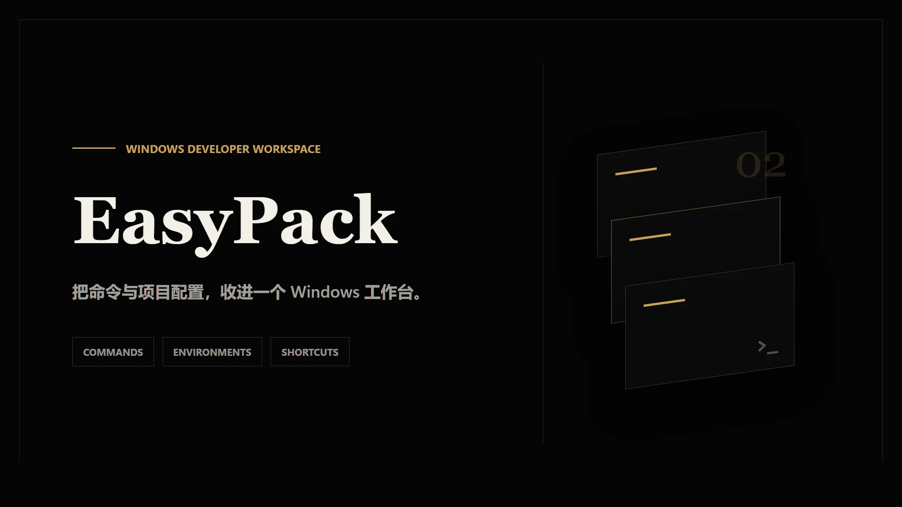
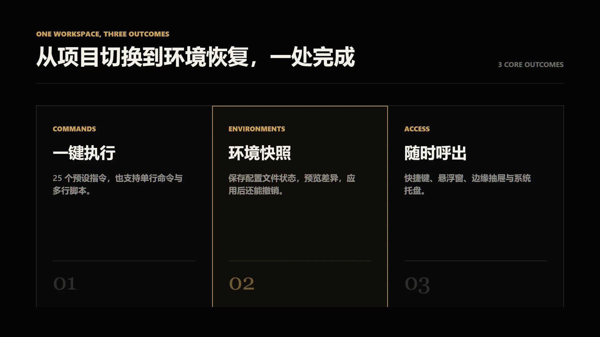

<div align="center">


# EasyPack

**Windows 开发者的项目指令与环境切换工具**



[](https://github.com/armok-c/EasyPack/releases/latest)
[](#系统要求)
[](./LICENSE)

</div>

EasyPack 把散落在不同项目里的常用命令、脚本和配置文件快照集中到一个桌面工作台。选中项目后，你可以直接执行指令，也可以保存、比较、应用和撤销项目环境，不必反复切换目录或手动替换配置文件。

## 为什么需要 EasyPack

同时维护多个本地项目时，重复工作通常不在写代码本身，而在进入目录、输入固定命令、寻找配置文件和恢复环境。EasyPack 把这些操作与项目绑定，让常用动作可以被保存、看见并重复使用。

## 你会得到什么



在同一个应用里，你可以管理多个本地项目，使用 25 条 Git、NPM、Python 和 Cargo 预设指令，也可以添加单行命令或多行脚本。项目环境功能支持选择项目内文件、创建和复制快照、预览差异与应用计划，并在需要时撤销上一次应用。

EasyPack 还提供全局快捷键、置顶悬浮窗、边缘抽屉、系统托盘和开机启动，让常用操作在不打断当前工作的情况下随时可用。

## 工作方式

1. 添加本地项目，EasyPack 会显示项目路径、目录大小和 Git 分支。
2. 点击指令卡片，在新的 `cmd.exe` 窗口中执行当前项目的命令或脚本。
3. 将需要切换的配置文件加入受管清单，创建不同的项目环境快照。
4. 应用前查看文件变更和逐行差异；应用后可按计划撤销。

## 快速开始

### 直接安装

从 [GitHub Releases](https://github.com/armok-c/EasyPack/releases/latest) 下载最新的 Windows 安装包并运行。

### 从源码运行

先按照 [Tauri Windows 前置要求](https://v2.tauri.app/zh-cn/start/prerequisites/) 安装 Microsoft C++ 生成工具、WebView2 和 Rust。建议使用 Node.js 20.19+ 或 Node.js 22 LTS。

```powershell
git clone https://github.com/armok-c/EasyPack.git
cd EasyPack
npm install
npm run tauri dev
```

构建 Windows 安装包：

```powershell
npm run tauri build
```

构建产物位于 `src-tauri/target/release/bundle/`。

## 系统要求

- Windows 10 或 Windows 11
- Microsoft Edge WebView2 Runtime
- 从源码运行时还需要 Node.js、Rust 和 Microsoft C++ 生成工具

## 能力边界

- EasyPack 当前只支持 Windows，不是跨平台应用。
- “项目环境”管理的是项目内选定文件的快照，不是 Windows 系统环境变量。
- 单行指令会打开新的 `cmd.exe` 窗口；多行脚本通过临时批处理文件执行。

## 技术栈

Tauri 2 · React 19 · TypeScript 5.7 · Tailwind CSS 4 · Rust

## 参与贡献

欢迎通过 [Issues](https://github.com/armok-c/EasyPack/issues) 报告问题或提出建议。提交改动前，请先在 Issue 中说明使用场景和预期结果。

## 许可证

EasyPack 使用 [MIT License](./LICENSE)。
